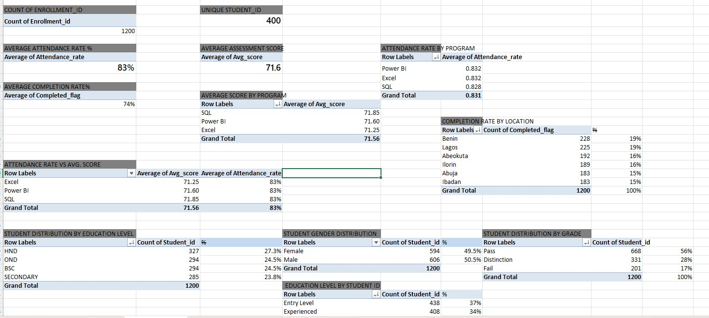
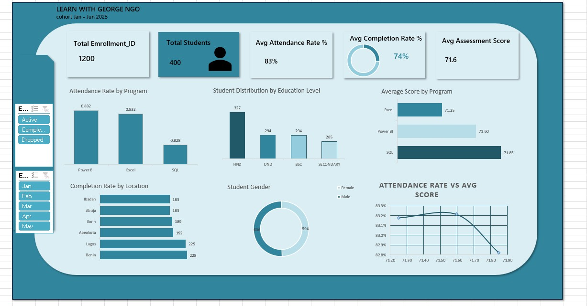

# LEARN-WITH-GEORGE-NGO-ANANLYIS

## Introduction
Learn With George NGO is a non-profit organisation operating in the education and digital skills training sector. The organisation provides training programs such as Power BI, Excel, and SQL across multiple locations.
This Excel project focuses on analysing student enrollment, attendance rates, completion status, and assessment performance to help the NGO evaluate training effectiveness and improve student outcomes.
## Project Objective
The main objective of this analysis is to track and evaluate the performance of Learn With George’s training programs. The project focuses on:
-	Analysing attendance rates to measure student engagement
-	Evaluating student performance through assessment scores
-	Reviewing program completion rates across different locations
-	Identifying trends and patterns to improve program effectiveness and student support

This project aims to build an interactive Excel dashboard that presents key performance indicators (KPIs) and provides visual insights for management decision making.
## Problem Statement

The NGO lacks a centralised performance dashboard to monitor student progress and program effectiveness.
Management needs help answering:
-	Which program has the highest attendance rate?
-	Which location has the highest completion rate?
-	Does attendance influence assessment performance?
-	What is the student distribution by gender and education level?
##  Data Sourcing
The dataset was sourced from a structured Excel dataset created for analysis purposes.
It contains:
-	1,200 enrollment records
- 400 unique students
-	Period: January 2025 – June 2025
Key fields include:
-	Student ID
- Enrollment ID
- Program
- Location
- Attendance Rate
- Completion Status
- Average Score
-	Gender
- Education Level
- Enrollment Month
- Duration
- Cohort
- Portfolio Program
- Intership
- Outcome Date
- Level
## Data Cleaning
The raw dataset initially contained 1,206 records, including 3 duplicate entries and empty spaces. The following cleaning and transformation steps were performed:

Duplicate Removal
- Identified and removed 3 duplicate records to ensure accurate reporting.

 Handling Empty Spaces
-	Cleaned blank cells and removed unnecessary white spaces using Excel functions such as TRIM().
-	Ensured consistency in text fields (e.g., location and program names).

## Date Transformation
### Enrollment Day and Month
- Created an Enrollment Day table
=TEXT([@[Enrollment_date]],"Ddd")
- Generated an Enrollment Month column using the TEXT() function:
=TEXT([Enrollment Date], "mmm")
### Assessment Grade
- Created a new column to categorise assessment scores using the IF() function:
IF([@[Avg_score]]>=79,"Distinction",IF([@[Avg_score]]>=60,"Pass","Fail"))

### Age Group
- An Age Group column was created to group students into meaningful categories for demographic analysis.
=IF([@Age]>=30,"Experienced",IF([@Age]>=25,"Mid Level", "Entry Level"))
## Analysis

## Dashboard Features

The interactive Excel dashboard includes:
### KPI Cards
-	Total Enrollments: 1,200
-	Total Students: 400
-	Average Attendance Rate: 83%
-	Average Completion Rate: 74%
-	Average Assessment Score: 71.6
 ### Charts
-	Attendance Rate by Program
-	Completion Rate by Location
-	Student Distribution by Education Level
-	Gender (Male 50.5% and Female 49.5%)
- Average Score by Program
-	Attendance Rate vs Average Score
### Slicers
- Completion Status (Active, Completed, Dropped)
- 	Month 
## Key Insights
- The differences between programs are very small less than 1 point overall, which suggests performance is relatively consistent across all three programs.
SQL’s slight lead may indicate stronger mastery of technical or logic-based concepts compared to the more tool-driven skills assessed in Excel and Power BI.
Excel’s lower average could signal a need for reinforcement in formulas, data modelling, or advanced features, especially if it is a foundational skill for participants.
- The overall attendance rate was calculated using Excel, Power BI, and SQL, resulting in 83.2% in Excel and Power BI and 82.8% in SQL.This consistency confirms the reliability of the attendance data across different platforms
- The student population is fairly balanced: HND holders lead with 327 (27.3%)students, followed by OND and BSc holders at 294 (24.5%) each, and secondary school graduates at 285 (23.8%).This shows that Learn with George’s programs attract learners from diverse educational backgrounds, highlighting their accessibility and inclusiveness.
- Completion rates vary noticeably by location. Benin (228) 19% and Lagos (225) 19% record the highest completions, indicating stronger learner engagement or support structures in these centers.  Abeokuta (192) 16% and Ilorin (189) 16% show moderate performance, while Ibadan and Abuja (183 each) 15% have the lowest completion counts.
- There is a non-linear relationship between attendance and average scores. Scores improve slightly as attendance increases up to a mid-range level (around 83.2–83.3%), indicating that consistent participation supports better performance.
This implies that while regular attendance is important, attendance by itself does not guarantee higher performance.
Other factors, such as study effectiveness, learner capability, or assessment difficulty, likely play a significant role at higher performance levels.
## Recommendation
- Students come from diverse educational backgrounds, showing the programs are accessible and inclusive.
- Performance across programs is closely aligned, with SQL slightly leading and Excel offering the greatest opportunity for improvement. 
- Given the narrow score range, curriculum alignment and assessment difficulty appear balanced, which is a positive indicator for program design.
- High performing locations can serve as benchmarks, while targeted interventions are needed to improve completion rates in lower-performing centers.
- Since SQL and Power BI are nearly tied, resources could focus on advanced or applied use cases rather than basic skill remediation.
- If prioritizing improvement efforts, Excel would yield the highest marginal gain with targeted training.

## TOOL: EXCEL

## EXCEL FILE
(Download Excel Dashboard)(./Learn-with-George-NGO.xlsx)
